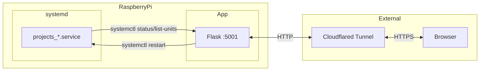

# Service Monitor

Web dashboard for monitoring and managing systemd services on a Raspberry Pi.

## Screenshot

 <!-- Add screenshot if available -->

## Tech Stack

`Python 3.12, Flask, systemd/systemctl, TailwindCSS (CDN), Jinja2`

## Architecture



**Data Flow:**
1. Flask queries systemd for services matching `projects_*` pattern
2. Parses status output for uptime, memory, CPU, errors
3. Renders dashboard with service status indicators
4. Restart commands sent via `sudo systemctl restart`

## Prerequisites

- Python 3.12+
- Miniconda/Conda
- systemd (Linux)
- `sudo` access for service restarts
- Cloudflared (for external access)

## Installation

1. Clone the repository:
   ```bash
   cd ~/rpi-notes
   ```

2. Run the install script:
   ```bash
   cd install
   ./install.sh
   ```

   This will:
   - Create conda environment `servicemonitor`
   - Install dependencies via Poetry
   - Install systemd service file
   - Configure Cloudflared tunnel

3. Configure sudoers (required for restart functionality):
   ```bash
   # Add to /etc/sudoers.d/servicemonitor
   mnalavadi ALL=(ALL) NOPASSWD: /usr/bin/systemctl restart projects_*
   ```

## Running

**Via systemd (production):**
```bash
sudo systemctl start projects_servicemonitor.service
```

**Manual (development):**
```bash
conda activate servicemonitor
python app.py
```

**Default URL:** `http://localhost:5001`  
**External URL:** `https://servicemonitor.mnalavadi.org` (via Cloudflared)

## Project Structure

```
rpi-notes/
├── app.py                              # Flask app, all routes and business logic
├── pyproject.toml                      # Poetry dependencies
├── install/
│   ├── install.sh                      # Full setup script
│   └── projects_servicemonitor.service # systemd unit file
├── templates/
│   └── index.html                      # Main dashboard template (Jinja2)
├── static/
│   └── style.css                       # CSS (unused, TailwindCSS via CDN)
└── cloudflared/
    └── config.yml                      # Cloudflared tunnel config
```

## API Endpoints

| Endpoint | Method | Description |
|----------|--------|-------------|
| `/` | GET | Dashboard view, lists all `projects_*` services |
| `/?service=<name>` | GET | Dashboard with detailed logs for selected service |
| `/restart` | POST | Restart a service |
| `/train-tracker/check` | POST | Run train tracker inspection check (service-specific) |

### POST `/restart`

Restarts a systemd service.

**Request:**
```
Content-Type: application/x-www-form-urlencoded

service=projects_example.service
```

**Response:** Redirects to `/?service=<name>` on success, 400/500 on error.

**Validation:** Service name must exist in `systemctl list-units projects_*`

### POST `/train-tracker/check`

Runs `/home/mnalavadi/train_tracker/scripts/check_inspections` for the train tracker service.

**Request:**
```
service=projects_train_tracker.service
```

**Response:** Redirects to index on success, 400/500 on error.

## Key Concepts

| Concept | Description |
|---------|-------------|
| `projects_*` | Naming convention for monitored services; only services matching this pattern are displayed |
| `ServiceStatus` | Dataclass holding parsed service info: name, is_active, is_failed, uptime, memory, cpu, last_error |
| Status Indicators | Green = active (running), Red = failed, Gray = inactive |
| Service Info | Raw output from `systemctl status <service> --lines=200` |

## Data Models

```
ServiceStatus
├── name: str              # Full service name (e.g., "projects_foo.service")
├── is_active: bool        # True if "active (running)" in status
├── is_failed: bool        # True if "failed" in status
├── uptime: str | None     # Parsed from "Active: ... since ...; X ago"
├── memory: str | None     # Parsed from "Memory: X"
├── cpu: str | None        # Parsed from "CPU: X"
└── last_error: str | None # Parsed from "Error: X"
```

## Storage / Persistence

| Location | Purpose |
|----------|---------|
| `/lib/systemd/system/projects_*.service` | systemd unit files for monitored services |
| No database | All state is read live from systemd |

## Configuration

| Variable | Location | Default | Description |
|----------|----------|---------|-------------|
| `host` | `app.py` | `0.0.0.0` | Bind address |
| `port` | `app.py` | `5001` | HTTP port |
| `service_pattern` | `app.py` | `projects_*` | systemctl filter pattern (hardcoded) |

## Deployment

**systemd unit file:** `install/projects_servicemonitor.service`

```ini
[Unit]
Description=Service Monitor
After=multi-user.target

[Service]
WorkingDirectory=/home/mnalavadi/rpi-notes
Type=idle
ExecStart=/home/mnalavadi/miniconda3/envs/servicemonitor/bin/python app.py
User=mnalavadi

[Install]
WantedBy=multi-user.target
```

**Cloudflared:** Configured via `add_cloudflared_service.sh` to expose on `servicemonitor.mnalavadi.org:5001`

## External Dependencies

| Service | Purpose | Auth |
|---------|---------|------|
| systemd | Service management | Local system |
| Cloudflared | HTTPS tunnel | Cloudflare account |

## Known Limitations

- Hardcoded paths to conda environments (`/home/mnalavadi/miniconda3/...`)
- Train tracker check endpoint is hardcoded to specific service and path
- No authentication on web interface
- Requires sudo for restart functionality (must configure sudoers)
- Only monitors services matching `projects_*` pattern
